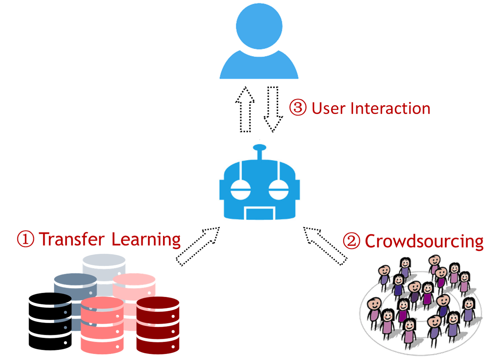

# Cross-Domain Semantic Parsing / Natural Language Interface

## The Cold Start Problem
Semantic parsing, which maps natural language utterances into computer-understandable logical forms, has drawn substantial attention recently as a promising direction for developing natural language interfaces to computers. There are so many domains (healthcare, finance, IoT, sports, *etc.*) for which we can build a natural language interface, making *portability / scalability* an impending challenge. Or in other words, it's the *cold start problem of natural language interface*: 

<p align="center"><i>Given a new domain, how can we build a natural language interface for it?</i></p>

<p align="center">

</p>

## Solution

There are three complementary ways to solve the cold start problem:

<p align="center">

</p>

1. Re-use the training data for some existing domains via *transfer learning* (this repo)
2. Collect training data for the new domain via *crowdsourcing* [[1](#reference1)] [[2](#reference2)]
3. Once we cold-started a natural language interface with reasonable performance, develop some *user-friendly interaction mechanism*, deploy the system and let it interact with real users so it can keep refining itself [[3](#reference3)] [[4](#reference4)]


# Use of This Repo

## Requirements

* Python 2.7
* Tensorflow 0.11 (yes the TF version is a bit old..but it's still working reasonably well!)
* Yaml (for logging)

## Setup

Install Tensorflow 0.11:

(GPU support)
```
export TF_BINARY_URL=https://storage.googleapis.com/tensorflow/linux/gpu/tensorflow-0.11.0-cp27-none-linux_x86_64.whl
pip install --ignore-installed --upgrade $TF_BINARY_URL
```

(CPU only)
```
export TF_BINARY_URL=https://storage.googleapis.com/tensorflow/linux/cpu/tensorflow-0.11.0-cp27-none-linux_x86_64.whl
pip install --ignore-installed --upgrade $TF_BINARY_URL
```


Install yaml:

```
pip install pyyaml
```

## Training
We use the [Overnight](https://github.com/percyliang/sempre/tree/master/overnight) dataset, which contains 8 domains including Basketball, Calendar, and Restaurants. The dataset is already pre-processed and can be found under [`data`](data/). 

Assume we are at the the root of the repo. All of training and testing can be done with the following command:

```
sh scripts/batch_run.sh 0 train_grid_unit_var overnight 0
```

The arguments are:

* `GPU ID`: which GPU to use for this run?
* `Training Script`: each word embedding initialization has a separate script
* `Dataset`: for now, the only option is `overnight`
* `Execution Number`: a unique number for this execution. A corresponding dir will be created under `execs/` to host the trained model and the log of this execution.

The command will do the following tasks for each of the 8 domains:

1. In-domain: Train and test
2. In-domain: Re-train with the full training data (i.e., training+validation) and then test (final results for in-domain setting)
3. Cross-domain: Pre-training on the source domains
4. Cross-domain: Warm-start on target domain with pre-trained model, fine-tune with in-domain data, and test
4. Cross-domain: Re-train with full in-domain training data and then test (final results for cross-domain setting)

It's easy to train for another word embedding initialization strategy, e.g., original `word2vec` embedding without standardization. Just change the training script and execution number:

```
sh scripts/batch_run.sh 0 train_grid_original overnight 1
```

## Extract Testing Results

We provide a script to make it easy to extract the testing results across all of the domains. For example,

In-domain, exec_num=0, re-training with full training data:

```
python scripts/extract_test_result.py in-domain overnight 0 1
```

In-domain, exec_num=0, no re-training:

```
python scripts/extract_test_result.py in-domain overnight 0 0
```

Cross-domain, exec_num=5, re-training with full training data:

```
python scripts/extract_test_result.py cross-domain overnight 5 1
``` 


## References

Please refer to the following paper for more details. If you find it useful, please kindly consider to cite:

```
@InProceedings {su2017cross,
    author    = {Su, Yu and Yan, Xifeng},
    title     = {Cross-domain Semantic Parsing via Paraphrasing},
    booktitle = {Proceedings of the Conference on Empirical Methods in Natural Language Processing},
    pages     = {1235--1246},
    year      = {2017},
    address   = {Copenhagen, Denmark},
    month     = {Sept},
    publisher = {Association for Computational Linguistics}
}
```

#### Other references for cold-starting a natural language interface

<a name="reference1"></a>[1] Yu Su, Ahmed Hassan Awadallah, Madian Khabsa, Patrick Pantel, Michael Gamon, Mark Encarnacion. *Building Natural Language Interfaces to Web APIs*. CIKM 2017.

<a name="reference2"></a>[2] Yu Su, Huan Sun, Brian Sadler, Mudhakar Srivatsa, Izzeddin Gur, Zenghui Yan, Xifeng Yan. *On Generating Characteristic-rich Question Sets for QA Evaluation*. EMNLP 2016.

<a name="reference3"></a>[3] Izzeddin Gur, Semih Yavuz, Yu Su, Xifeng Yan. *DialSQL: Dialogue Based Structured Query Generation*. ACL 2018.

<a name="reference4"></a>[4] Yu Su, Ahmed Hassan Awadallah, Miaosen Wang, Ryen White. *Natural Language Interfaces with Fine-Grained User Interaction: A Case Study on Web APIs*. SIGIR 2018
